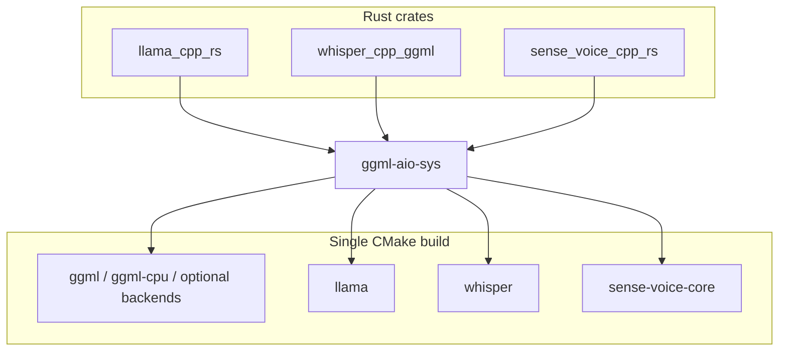

# ggml-aio-rs

Cargo workspace that builds a **single CMake graph** over vendored [ggml](https://github.com/ggerganov/ggml) / [llama.cpp](https://github.com/ggerganov/llama.cpp) / [whisper.cpp](https://github.com/ggerganov/whisper.cpp) / [sense-voice.cpp](https://github.com/ggml-org/sense-voice.cpp) sources and exposes **Rust bindings** on top of generated `ggml-aio-sys` FFI.

## Layout

```text
ggml-aio-rs/
├── Cargo.toml                 # workspace root
├── ggml-aio-sys/              # -sys crate: CMake + bindgen → static libs + bindings.rs
│   ├── build.rs
│   ├── wrapper.h
│   └── cc/                    # CMake project (subtrees: ggml, llama.cpp, whisper.cpp, sense-voice.cpp)
├── llama-cpp-rs/              # Safe-ish wrappers for llama.cpp (crate: llama_cpp_rs)
├── whisper-cpp-rs/            # whisper.cpp bindings (package name: whisper-cpp-ggml, crate: whisper_cpp_ggml)
├── sense-voice-cpp-rs/        # sense-voice.cpp bindings (crate: sense_voice_cpp_rs)
├── qwen3-tts-cpp-rs/          # qwen3-tts.cpp bindings (crate: qwen3_tts_cpp_rs)
└── qwen3-asr-cpp-rs/          # qwen3-asr.cpp bindings (crate: qwen3_asr_cpp_rs)
```



## Crates

| Path / package | Library name | Role |
|----------------|--------------|------|
| `ggml-aio-sys` | `ggml_aio_sys` | Raw FFI (`include!(bindings.rs)`), no safe API. |
| `llama-cpp-rs` | `llama_cpp_rs` | `LlamaBackend`, `LlamaModel`, `LlamaContext`, batches, sampling, optional `mtmd`. |
| `whisper-cpp-rs` (`whisper-cpp-ggml`) | `whisper_cpp_ggml` | `WhisperContext`, `WhisperState`, params, audio helpers. |
| `sense-voice-cpp-rs` | `sense_voice_cpp_rs` | `SenseVoiceContext`, decode params / builder. |
| `qwen3-tts-cpp-rs` | `qwen3_tts_cpp_rs` | `Qwen3Tts` wrapper + synthesize helpers. |
| `qwen3-asr-cpp-rs` | `qwen3_asr_cpp_rs` | `Qwen3Asr` wrapper + file transcription helper. |

## Build prerequisites

- **CMake** (3.20+), **C/C++ toolchain** matching your target.
- **libclang** available to **bindgen** (for `bindings.rs`).
- Optional backends: set the usual environment variables (e.g. `CUDA_PATH`, `VULKAN_SDK`, `ANDROID_NDK_HOME` for Android). See `ggml-aio-sys/build.rs` for details.
- **docs.rs**: the `-sys` build skips the native link step when `DOCS_RS` is set.

### `ggml-aio-sys` features (forwarded by higher-level crates where noted)

| Feature | Effect (high level) |
|---------|---------------------|
| `cuda` / `cuda-no-vmm` | NVIDIA CUDA backend |
| `metal` | Apple Metal (macOS/iOS targets) |
| `vulkan` | Vulkan backend |
| `hipblas` | AMD ROCm / HIP |
| `openmp` | OpenMP where applicable |
| `mtmd` | Multimodal (llama.cpp MTMD); extra bindgen + static `mtmd` compile |
| `shared-stdcxx` | Android-oriented libc++ linking |
| `native` | Passed through to CMake / tooling as needed |

`llama-cpp-rs` defaults include `android-shared-stdcxx` → `ggml-aio-sys/shared-stdcxx`.

## Usage

Add workspace members as path dependencies (or publish and use versions):

```toml
[dependencies]
llama_cpp_rs = { path = "../ggml-aio-rs/llama-cpp-rs" }
# or
whisper_cpp_ggml = { path = "../ggml-aio-rs/whisper-cpp-rs", package = "whisper-cpp-ggml" }
sense_voice_cpp_rs = { path = "../ggml-aio-rs/sense-voice-cpp-rs" }
qwen3_tts_cpp_rs = { path = "../ggml-aio-rs/qwen3-tts-cpp-rs", package = "qwen3-tts-cpp-rs" }
qwen3_asr_cpp_rs = { path = "../ggml-aio-rs/qwen3-asr-cpp-rs", package = "qwen3-asr-cpp-rs" }
```

Enable GPU features explicitly, e.g. `llama_cpp_rs = { path = "...", features = ["cuda"] }`.

### llama.cpp (`llama_cpp_rs`)

Typical flow: initialize the backend once, load a GGUF, create a context, then run decode/sampling (see crate docs and `context`, `model`, `llama_batch` modules).

```rust
use llama_cpp_rs::{
    llama_backend::LlamaBackend,
    model::{params::LlamaModelParams, LlamaModel},
    context::params::LlamaContextParams,
};

let backend = LlamaBackend::init()?;
let model = LlamaModel::load_from_file(
    &backend,
    "model.gguf",
    &LlamaModelParams::default(),
)?;
let mut ctx = model.new_context(&backend, LlamaContextParams::default())?;
// use ctx.decode(...), sampling, etc.
```

The crate intentionally stays close to llama.cpp's C API while providing ownership-safe wrappers; for a more curated API, see also [llama-cpp-2 on crates.io](https://crates.io/crates/llama-cpp-2) (as noted in `ggml-aio-sys` docs).

### whisper.cpp (`whisper_cpp_ggml`)

```rust
use whisper_cpp_ggml::{WhisperContext, WhisperContextParameters};

let params = WhisperContextParameters::default();
let ctx = WhisperContext::new_with_params("ggml-model.bin", params)?;
// create WhisperState, run full transcribe with FullParams / audio slice
```

Optional: `install_logging_hooks()` with `log_backend` / `tracing_backend` features.

### SenseVoice (`sense_voice_cpp_rs`)

```rust
use sense_voice_cpp_rs::{
    SenseVoiceContext, SenseVoiceContextParameters,
    SenseVoiceDecodingStrategy, SenseVoiceFullParams,
};

let ctx = SenseVoiceContext::new_with_params(
    "model.bin",
    SenseVoiceContextParameters::new(),
)?;
let params = SenseVoiceFullParams::default_params(SenseVoiceDecodingStrategy::SamplingGreedy);
// pass audio + params into the C API via the crate's transcribe helpers
```

### Qwen3 ASR (`qwen3_asr_cpp_rs`)

```rust
use qwen3_asr_cpp_rs::{Qwen3Asr, Qwen3AsrParams};

let mut asr = Qwen3Asr::new("qwen3-asr-0.6b-f16.gguf")?;
let result = asr.transcribe_file(
    "audio.wav",
    &Qwen3AsrParams::default().n_threads(4).max_tokens(1024),
)?;
println!("{}", result.text);
```